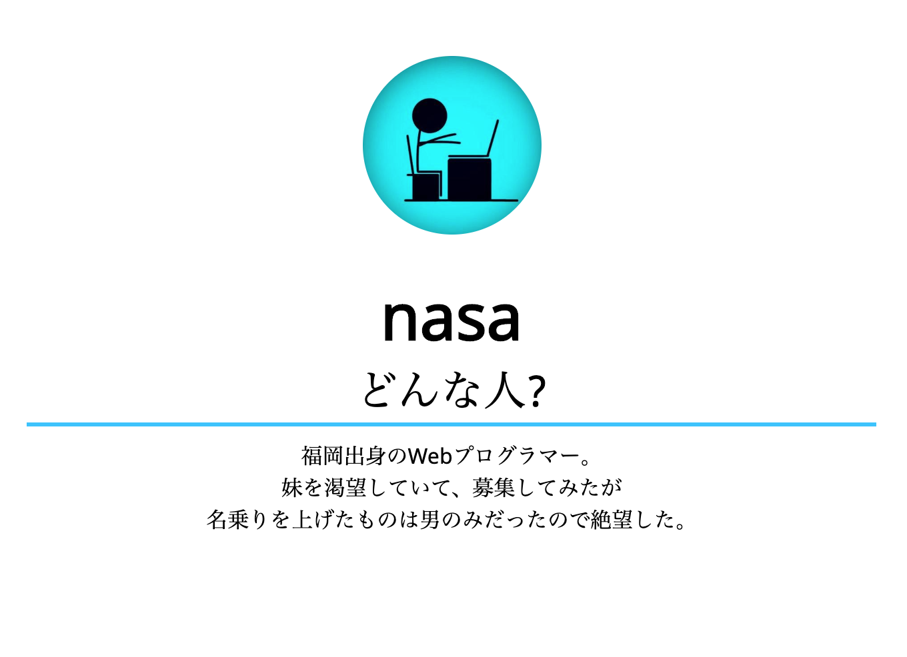
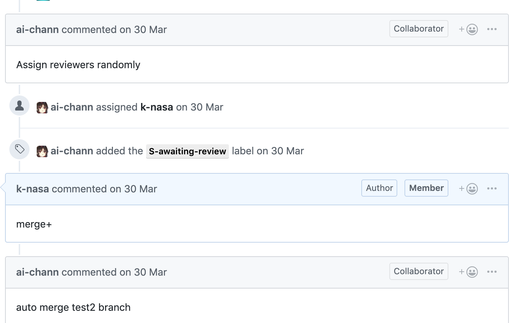
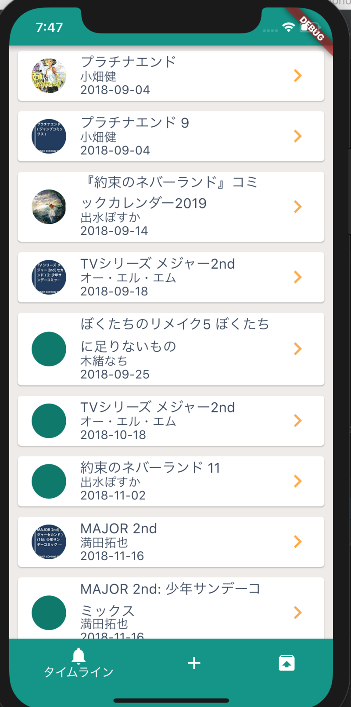
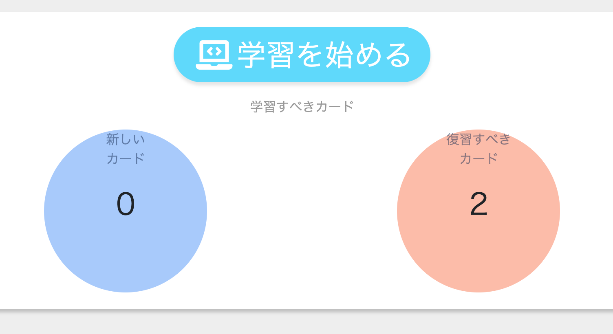

## 初めまして nasa です!

サポーターズ 1on1 面談イベント

---

## Agenda

1. 私について
2. 今までにやってきたこと
3. 今やっていること
4. これから

---

# 1. About me

詳しくは web で!

https://k-nasa.me

---

name: nasa (近藤アサン)

所属: 福岡工業大学 情報通信工学科 ３年

lanugage: Rust, Ruby, React, Elm

インターン: マネーフォワード, エウレカ

オタクを名乗るのは恐れ多いがオタク(仮)

GitHub: k-nasa

---

# 2. やってきたこと

---

- 使用言語: Elm, CSS
- 製作期間 3 日
- Elm の試運転のために作った

---

#### 飯テロ bot (LINE ボット)

- 使用言語: Ruby
- 製作期間: 1,2 日
- はじめてのハッカソン作品、 LINE 賞 && LINE Clova GET!

---

- 使用言語: Rust
- 製作期間: 2 週間 + 時々機能追加
- GitHub bot レビュアーアサイン,PR マージ(delete branch)
- GitHub API ラッパーにパッチを投げる必要
- popuko の issue で Rust に書き直すというのがあってやってみたくなった

---

- 使用言語: Dart/Flutter, Ruby/Rails
- 製作期間: 3 ヶ月
- 本の買い忘れが続いた

---

#### MF クラウド経費の開発

- 使用言語: Ruby/Rails, JS/React/JQuery
- 期間: 1 年

---

その他

https://k-nasa.me/works

---

# 3. 今やってること

---

- 使用言語: Elm
- 製作期間: 2 週間
- 友達とのチーム開発
- 最適なタイミングで学習するためのアプリ

---

- Cargo/tide への contribute
- isucon

---

# 4. これから

結構ふわふわしてます、、、

---

- クリエイターさんに関わるサービス開発がしたい
- カンファレンスで登壇したい
- 海外を旅して回りたい
